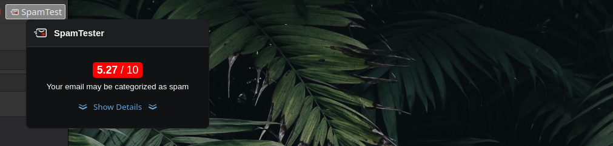

# Thunderbird - SpamTester

A Thunderbird extension that shows the spam score of the email you are composing.



## Developping

```bash
# Install dependencies
npm install

# Build
npm run build

# Build with file changes watching
npm run build:watch
```

### Installing the developpment Add-On

1. Open `Add-ons Manager` in Thunderbird
2. Click `Settings` (gear icon)
3. Select `Debug Add-ons`
4. Click `Load Temporary Add-on`
5. Select `manifest.json`

See [https://developer.thunderbird.net/add-ons/mailextensions/hello-world-add-on#installing](https://developer.thunderbird.net/add-ons/mailextensions/hello-world-add-on#installing) for more details.

### Packaging

Create a `spamtester.xpi` package.

```bash
npm run package
```
